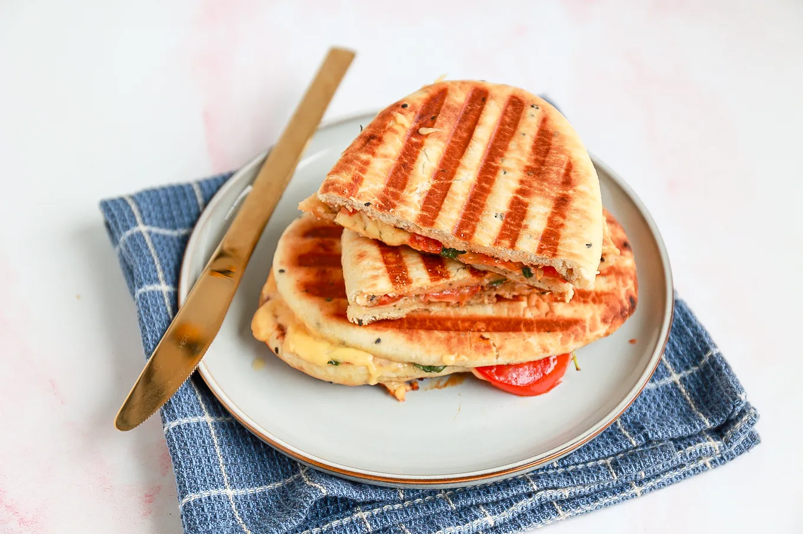

# Tosti Met Kaas

## BENODIGDHEDEN

* 4 naan
* kruidenboter
* 4 plakjes kaas
* 1 tomaat
* 2 plakjes kipfilet
* rucola
  
### BEREIDING

1. Besmeer twee naan met kruidenboter
2. Snijd de tomaat in plakjes en beleg het brood met tomaat, kaas, kipfilet en rucola.
3. Leg de andere naan erop en bak de naan tosti op een tafelgrill of in de pan met een beetje olie voor 5 minuten todat de kaas is gesmolten.
[lekkerensimpel](https://www.lekkerensimpel.com/naan-tosti-met-kaas/)